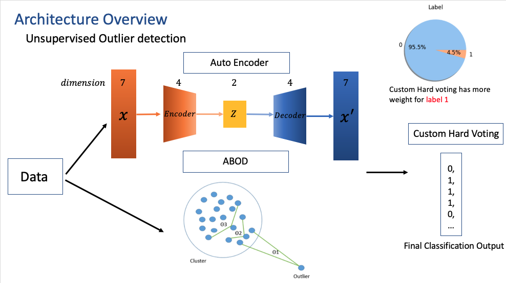
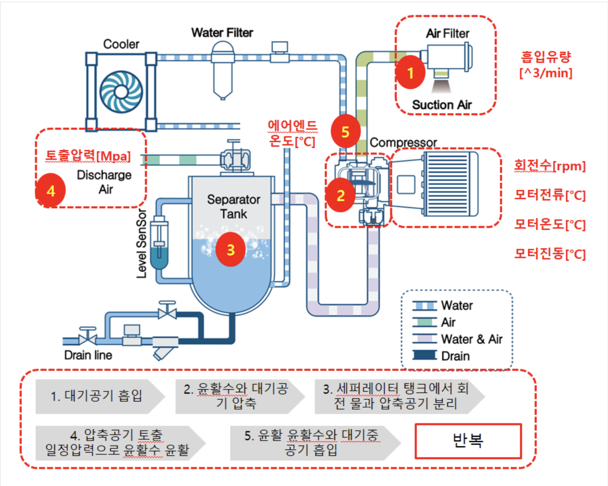

# 2023 AI Factory Outlier Detection Air Compressor faults Top 6% Solution
AI solution that Outlier detection of Air Compressor

## Solution Overview


## Team member  
|||||  
|-|-|-|-|
|[Jiyul Ham](https://github.com/YUL-git), Leader|[Jaeyoon Jung](https://github.com/lastdefiance20)|[Hannah Yun](https://github.com/HannahYun)|[Hyundo Lee](https://github.com/onsemiro11)|

## File Structure
```
┖ figures
  ┖ ~
┖ AE_ABOD_SOTA_.ipynb
```
  
AE_ABOD.ipynb  
- Train and Test the Unsupervised classification model

## Dataset Overview
  
We train and evaluate our model using the dataset from [Outlier detection of Air Compressor](https://aifactory.space/competition/data/2226)

we assume that you have downloaded it and placed based on File Structure, inside the dataset folder.

## Submission Process  
Run All code in 'AE_ABOD.ipynb' to classify abnomalies of air compressor
